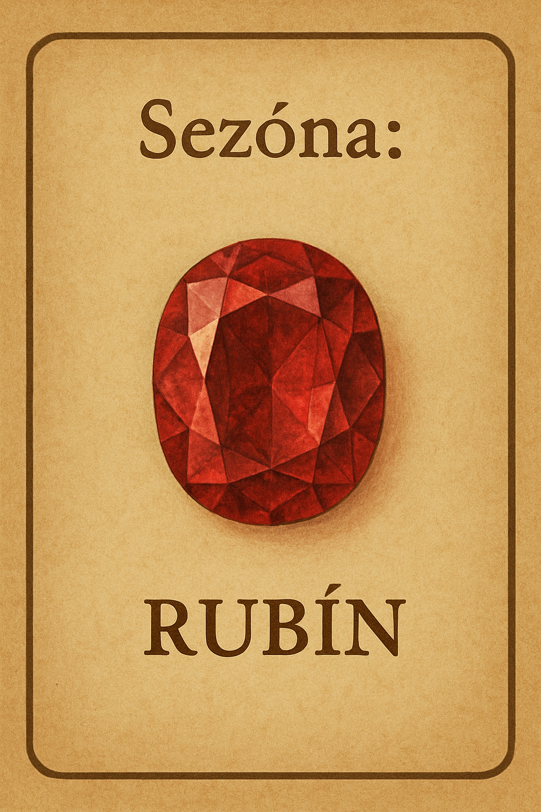

# Splendor rozšíření: Sezóny

- [Splendor rozšíření: Sezóny](#splendor-rozšíření-sezóny)
    - [Údálost (změna ceny)](#údálost-změna-ceny)
    - [Tabulka karet žetonů](#tabulka-karet-žetonů)
    - [Tabulka karet údálostí](#tabulka-karet-údálostí)
    - [Herní příklad](#herní-příklad)

Přicházejí sezónní slevy (zdražení) na nákup karet. 
Vybrané kameny jsou na kartách levnější, nebo dražší podle údálostí ve hře.

Dva balíčky karet:
- Sezóny - určují barvu. 
- Ceny - ty mohou klesat nebo růst.

Hráč může a nebo nemusí hodit kostkou na začátku svého tahu. Pokud padne 6, mění se sezóna. Hráč otočí vrchní kartu z obou balíčků.

Barvy kamenů:
- 💎 Bílý diamant
- ⚫ Černý onyx
- 🔴 Červený rubín
- 🟢 Zelený smaragd
- 🔵 Modrý safír
- 🟡 Žluté zlato

Barvy žetonů pro které mohou být slevy jsou rovnoměrně zastoupené herní žetony kromě zlata.

### Údálost (změna ceny)
Ceny se mohou měnit: -2, -1, +1, +2

Počet událostí: 5, 10, 15

Typy událostí:
- **+2** - Zavalený důl, Parné léto 
- **+1** - Změna vkusu, královská daň, potopená loď, ledový průsmyk, rozbouřené moře, piráti
- **-1** - Obchodní smlouva, cechovní podpora, krátká zima, vydatná žíla, příznivý vítr
- **-2** - Nová naleziště, Snížené clo

### Tabulka karet žetonů

10 karet sezón, každý 2 kusy.

| Diamant | Onyx | Rubín | Smaragd | Safír |
|---|---|---|---|---|
|  |  |  |  |  |

> [!note]
> Obrázky vygeneroval ChatGPT.

### Tabulka karet údálostí

15 karet událostí, každý 1 kus.

| +2 Zavalený důl | +2 Parné léto |
|---|---|
|  |  |

| +1 Změna vkusu | +1 Královská daň | +1 Potopená loď | +1 Ledový průsmyk | +1 Rozbouřené moře | +1 Piráti |
|---|---|---|---|---|---|
|  |  |  |  |  |  |

| -1 Obchodní smlouva | -1 Cechovní podpora | -1 Krátká zima | -1 Vydatná žíla | -1 Příznivý vítr |
|---|---|---|---|---|
|  |  |  |  |  |

| -2 Nová naleziště | -2 Snížené clo |
|---|---|
|  |  |

### Herní příklad
Na kartách je kombinace:
*-2 "zelené"*

Znamená to slovu na nákup karty. Všechny karty které mají v ceně zelené žetony jsou tedy levnější (až od dva zelené žetony) (cena nemůže být záporná).

| Půvpdní cena | Nová cena |
|--------------|-----------|
| 2 bílé       | 2 bílé    |
| 1 černý      | 2 černé   |
| 3 zelené     | 1 zelené  |

Na kartách je kombinace:
*+1 "bílé"*

Při nákupu karet s cenou v bílých žetonech musíte k ceně (bílým) přičíst +1.

| Půvpdní cena | Nová cena |
|--------------|-----------|
| 2 bílé       | 3 bílé    |
| 1 černý      | 2 černé   |
| 3 zelené     | 3 zelené  |