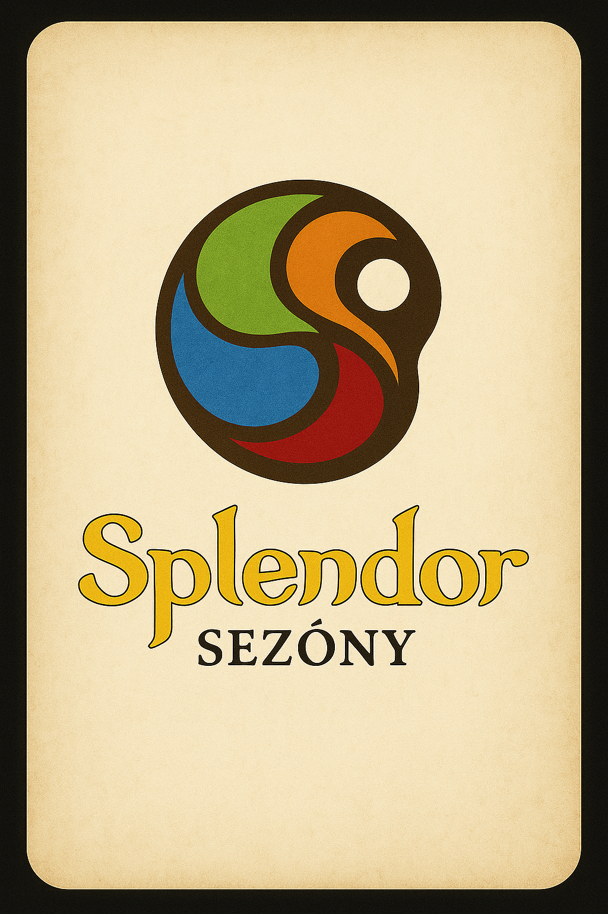

# Splendor rozšíření: Sezóny

- [Splendor rozšíření: Sezóny](#splendor-rozšíření-sezóny)
  - [Rozšíření](#rozšíření)
  - [Údálost (změna ceny)](#údálost-změna-ceny)
    - [Design událostí](#design-událostí)
  - [Tabulka karet Sezón (žetonů)](#tabulka-karet-sezón-žetonů)
  - [Tabulka karet událostí](#tabulka-karet-událostí)
  - [Úvodní text](#úvodní-text)
  - [Herní příklad](#herní-příklad)
  - [Přehledová kartička s nápovědou](#přehledová-kartička-s-nápovědou)

> [!warning] Právní upozornění:
> Název, logo a font „Splendor“ jsou ochrannými známkami společnosti Space Cowboys.
> Toto fanouškovské rozšíření „Splendor: Sezóny“ je neoficiální a vzniklo výhradně pro osobní, nekomerční použití.
> Všechny ochranné známky a práva duševního vlastnictví zůstávají ve vlastnictví jejich příslušných držitelů.

> [!warning] Legal Disclaimer:
> The name, logo, and font “Splendor” are trademarks of Space Cowboys.
> This fan-made expansion, “Splendor: Seasons,” is an unofficial, non-commercial project created solely for personal use.
> All trademarks and intellectual property rights remain the property of their respective owners.

## Rozšíření
Přicházejí sezónní slevy (zdražení) na nákup karet. 
Vybrané kameny jsou na kartách levnější, nebo dražší podle údálostí ve hře.

Dva balíčky karet:
- Sezóny - určují barvu. 
- Události - změna ceny, ty mohou klesat nebo růst.

Rubové karty:

| Pravidla | Sezóny | Události |
|--------|----------|----------|
|  |  |  |

Hráč může a nebo nemusí hodit kostkou na začátku svého tahu. Pokud padne 6, mění se sezóna. Hráč otočí vrchní kartu z obou balíčků.

Barvy kamenů:
- 💎 Bílý diamant
- ⚫ Černý onyx
- 🔴 Červený rubín
- 🟢 Zelený smaragd
- 🔵 Modrý safír
- 🟡 Žluté zlato

Barvy žetonů pro které mohou být slevy jsou rovnoměrně zastoupené herní žetony kromě zlata.

## Údálost (změna ceny)
Ceny se mohou měnit: -2, -1, +1, +2

Počet událostí: 5, 10, 15 (aby byli soudělné balíčky)

Typy událostí:
- **+2** - Zavalený důl ⛏️, Parné léto ☀️
- **+1** - Změna vkusu 💍, královská daň 👑, potopená loď ⚓, ledový průsmyk 🧊, rozbouřené moře 🌊, piráti 🏴‍☠️, Ztracená karavana 🐪
- **-1** - Obchodní smlouva 📜, cechovní podpora 🛠️, krátká zima ❄️, vydatná žíla 💎, příznivý vítr 💨
- **-2** - Nová naleziště 💎, Snížené clo 🪙

### Design událostí
Použito jako popis pro generování obrázků v ChatGPT.

**+1**

| Text na kartě | Popis obrázku |
|---------------|----------------|
| +1 Změna vkusu | Ruka s diamantovým prstenem, noblesní styl, detail na šperk. |
| +1 Královská daň | Obchodník odevzdává truhlu s mincemi ozbrojenému výběrčímu v brnění s královským znakem. |
| +2 Potopená loď | Loď rozervaná bouří, naražená na kameny. |
| +1 Ledový průsmyk | Horský průsmyk zavátý sněhem a ledem, vánice, chladná modro-bílá paleta. |
| +1 Rozbouřené moře | Bouřlivé moře, černé mraky, déšť, blesk v dálce. |
| +1 Piráti | Pirátská loď na rozbouřeném moři, vlající černá vlajka. |
| +1 Ztracená karavana | Karavana velbloudů v písečné bouři, pouštní duny a mizící obzor. |

+2 
| Text na kartě | Popis obrázku |
|---------------|----------------|
| +2 Zavalený důl | Štola s kameními a zřícený důl. Kamenné bloky a dřevěné výztuže. |
| +2 Parné léto | Černoch u vchodu do dolu. Utírá si pot z čela. Na vše praží slunce. Uvadlá tráva na zemi. |

**-1** 
| Text na kartě | Popis obrázku |
|---------------|----------------|
| -1 Obchodní smlouva | Papír na stole s husím brkem a pečeť. |
| -1 Cechovní podpora | V popředí mistr cechu podává měšec mladému učni nebo obchodníkovi (symbol podpory). |
| -1 Krátká zima | Krajina, kde tají sníh – polní cesta, tůně vody, první sluneční paprsky. |
| -1 Vydatná žíla | Žila ve skále na které jsou vidět drahé kameny. |
| -1 Příznivý vítr | Loď na moři s napnutýma plachtama. |

**-2**
| Text na kartě | Popis obrázku |
|---------------|----------------|
| -2 Nová naleziště | Důl s otvorem do jeskyně kde se třpytí diamanty. |
| -2 Snížené clo | Stůl s měšcem zlaťáků. Další peníze jsou na stole před ním. |

> [!note]
> Obrázky vygeneroval ChatGPT.

## Tabulka karet Sezón (žetonů)

10 karet sezón celkem, 5 druhů - každý 2 kusy.

| Diamant | Onyx | Rubín | Smaragd | Safír |
|---|---|---|---|---|
|  |  |  |  |  |

## Tabulka karet událostí

15 karet událostí, každý 1 kus.

| +2 Zavalený důl | +2 Parné léto | +2 Potopená loď |
|---|---|---|
|  |  |  |

| +1 Změna vkusu | +1 Královská daň |  +1 Ledový průsmyk | +1 Rozbouřené moře | +1 Piráti |
|---|---|---|---|---|
|  |  |  |  |  |

| -1 Obchodní smlouva | -1 Cechovní podpora | -1 Krátká zima | -1 Vydatná žíla | -1 Příznivý vítr |
|---|---|---|---|---|
|  |  |  |  |  |

| -2 Nová naleziště | -2 Snížené clo |
|---|---|
|  |  |

## Úvodní text

[Úvodní text](./Úvod.md)

Benáčtí obchodnící čelí nečaným událostem, které mohou s jinak výdělečnými ochody s diamantami rychle zamávat. 

Námořní doprava je nebezpečná a zrádná. Navyzpytatelné počasí si na obdhocních lodích vybírá svou daň stejně draze jako ti prokletí piráti. Lodě se vracejí čím dál častěji poškozené a občas nevrátí vůbec...
No ale na druhou stranu, ani na pěvnině to není zrovna růžové. Najmete si takhle třeba karavanu a ona se ztratí v poušti i s nákladem!
Ještě aby letos nepřišla tuhá zima. Zapadají horské průsmyky na Kavkazu a co pak?

A vůbec vám nemluvte o králi! Zas ty jeho válečná tažení v Toskánksu. Kdo chtěl vůbec tu jednotnou Itálii? No vy ne, bylo vám tu dobře i bez něj. Prý se dokonce chystá uvalit novou daň z obchodu s darými kameny. 

Aspoň že váš cech drží při sobě a krejete si záda před konkurencí, držet alespoň část trhu pevně v rukách je mocná zbraň, která vám umožnuje se občas podělit o nebývale vysoké zisky. Snažíte se větřít králi do jeho přízně a přesvědčit ho, aby alespoň snížil clo pro dovezený náklad z vašich lodí. Ale není to s ním lehké, ještě aby se mu změnil vkus!

Investice do prospektorů se také začíná pomalu vyplácet. Přišli zprávy o tom, že objevili nová slibná naleziště nedaleko tech stávajích a můžete uvažovat o rozšíření těžby. 

Do toho všeho se musíte věnovat běžným povinostem obchodníka s lukrativním zbožím. Uzavírat smlouvy se skoupími prodejci. 

## Herní příklad
Na kartách je kombinace:
*-2 "zelené"*

Znamená to slovu na nákup karty. Všechny karty které mají v ceně zelené žetony jsou tedy levnější (až od dva zelené žetony) (cena nemůže být záporná).

| Původní cena | Nová cena |
|--------------|-----------|
| 2 bílé       | 2 bílé    |
| 1 černý      | 2 černé   |
| 3 zelené     | 1 zelené  |

Na kartách je kombinace:
*+1 "bílé"*

Při nákupu karet s cenou v bílých žetonech musíte k ceně (bílým) přičíst +1.

| Původní cena | Nová cena |
|--------------|-----------|
| 2 bílé       | 3 bílé    |
| 1 černý      | 2 černé   |
| 3 zelené     | 3 zelené  |

## Přehledová kartička s nápovědou

[Přehled text](Přehled.md)

